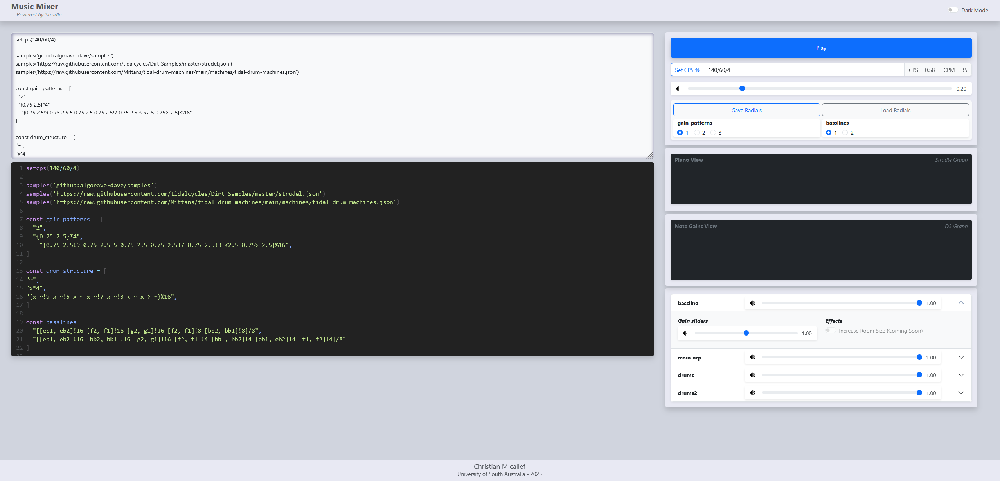

# Strudle Demo - Assignment 2 - Miccj006

## Features
All features of the application are clearly labelled within the app.
The app includes:
- Master control section with a play/stop button, cycle adjustment, patterns that you can save and load
- Graphs for a Piano View and a Gains view for each note
- Instrument dropdown section where you can adjust or mute each instrument's master volumes or individual volumes
- A text section in the top left where you can edit the song code
- A Streple view in the bottom left where the final song output is displayed

## Quirks and Usage Guidelines
Some things to note about the app are:
- You will get a bootstrap alert if you attempt to play the app with no song text written
- The radial buttons have been hard-coded to search for specific text and use pre-defined values
- Presets are saved and loaded locally from within the browser, and only saves the selected radial options
- The gain sliders within each instrument cannot be muted despite it looking visually similar to the master sliders
